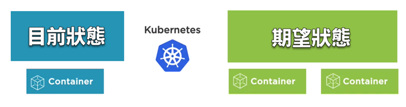
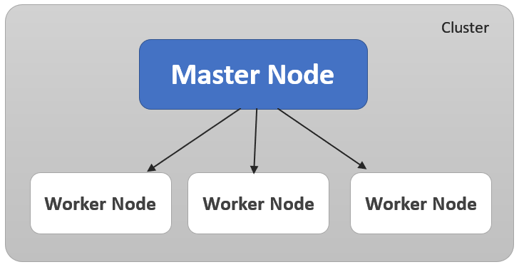
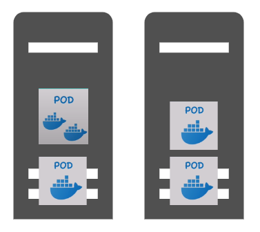
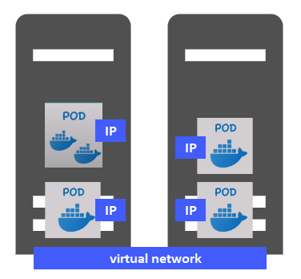
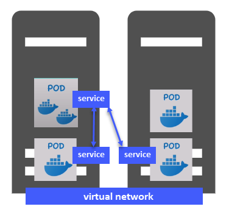

# Kubernetes 基礎觀念

## 背景知識

讀者至少需要對以下技術名詞有基本概念：

- 虛擬機器（virtual machine；VM）
- 容器（container）

## 概述

隨著應用程式的設計方式從單體（monolith）逐漸轉變成微服務（microservices），DevOps 工程師需要管理的容器愈來愈多，架構也愈來愈複雜。為了應付日益繁重的開發與維運工作，Google 設計了一套工具，並且在公司內部使用了 15 年之後開放原始碼，捐給 CNCF (Cloud Native Computing Foundation)。該專案便是 Kubernetes 的前身。

大體而言，Kubernetes 提供了以下好處：

- 方便管理多個容器。
- 高可用性（high availablity），zero downtime 部署。 
- 自我修復。
- 擴展性（scalability）。

那麼，什麼是 Kubernetes？

首先來看官方網站的一段簡短介紹：

> [Kubernetes](https://kubernetes.io/docs/concepts/overview/), also known as K8s, is an open-source system for automating deployment, scaling, and management of containerized applications.
> 
> 中文：Kubernetes 又稱為 K8s，是個開源系統，用來自動部署、擴展、和管理容器應用程式。

這段介紹對於剛入門學習的新手來說可能過於精簡，不妨搭配一個常見的比喻來協助理解：交響樂團。

K8s 就像是一個交響樂團的指揮，而演奏各種樂器的樂團成員則像是提供各種服務的容器。樂團成員（容器）必須聽從指揮（K8s）的安排和指示來演奏。如果樂團成員臨時出狀況而無法正常演出，指揮可能會指派其他人來替補，以確保演奏順利成功。

簡單來說，K8s 能夠讓我們以宣告的方式來定義**叢集**（cluster）的狀態。什麼是叢集呢？接著以一個簡單的例子來認識叢集，以及 K8s 的其他重要元件。

假設原本的作業環境只有一個容器在運行，而我們希望讓它變成兩個容器，如下圖。

我們可以用一個純文字檔案來描述你想要以怎樣的配置來運行整個系統（內容通常以 yaml 語法編寫），而 K8s 就會依照檔案中的指示來進行調配，以確保整體環境符合我們期望的狀態。這便是 K8s 能替我們做的事。

一言以蔽之，K8s 的主要功能就是：讓系統環境以我們想要的方式來運行（desired state management）。

## Master Node、Worker Node、Cluster

欲實現上述情境，自然需要多台主機來讓 K8s 發揮其功能。主機可以是實體機或目前更常見的虛擬機，統稱為「節點」（node）。實務上，我們會有一個或多個**主要節點**（master nodes）來擔任管理的角色，管理誰呢？管理其他負責各種任務的節點，即所謂的「**工作節點**」（worker nodes）。每個工作節點包含一個或多個容器應用程式，而這一群工作節點以及主節點集合起來，便是所謂的叢集（cluster）。

其中最重要的是主要節點，因為一旦主要節點故障，整個叢集當中的所有工作節點也將無法正常運行。此外，工作節點通常負載較重、需要較多資源，因為它們要運行多個容器應用程式。

!!! info
    這裡的 Master Node 在官方文件中比較常用的對等名詞是 Control Plane（控制平面）。

現在我們已經初步認識了 K8s 的三個基礎元件：Master Node、Worker Node、Cluster。接著來看另一個重要的元件：Pod。

## Pod

Pod 是容器的 host，也是配置與部署的最小單位，因為我們（DevOps 工程師）在 K8s 叢集中配置或部署的對象都是 pods，而不是直接去處理容器。

由此可見，pod 就像是一個抽象層，裡面包覆著容器。你也可以把 pod 理解成一個箱子，而這個箱子裡面裝著容器。實務上比較常見的情形是一個 pod 裡面只裝載一個容器，但也可以裝載多個容器。

對於一個 pod 僅裝載一個容器的場景，你甚至可以把它想像成一個穿著太空衣的太空人：pod 就如太空衣，而真正執行各項任務的是太空衣裡面的人，亦即容器。那麼，多位太空人（pods）彼此之間要如何溝通呢？它們需要倚賴 K8s 叢集裡面的另一個基礎元件：**虛擬網路**（virtual network）。

K8s 叢集中的虛擬網路會給每一個 pod 指派專屬的 IP 位址。也就是說，每一個 pod 就像是一個伺服器，擁有自己的 IP 位址。各個 pods 之間便可透過內部的 IP 位址來相互溝通。

剛才提過，我們並不會直接去處理 K8s 叢集當中的容器，而是對 pods 來進行相關操作。一旦 pod 當中的某個容器故障了，或者完全停擺，我們也無須介入，因為 pod 當中的容器將會自動重啟。那麼，如果是 pod 本身掛掉呢？此時 K8s 會替那個掛掉的 pod 再建立一個新的執行個體。

然而，每當一個新的 pod 被建立起來，它就會有一個新的 IP 位址，這會造成一些困擾。舉例來說，假設有一個 pod A 是提供資料庫伺服器的功能，而其他 pods 是透過 IP 位址來存取 pod A 的資料庫，那麼每當 pod A 因為故障而重新建立，IP 位址隨之改變，就會導致其他 pods 無法存取資料庫。針對這種情形，我們必須認識 K8s 的另一個元件：**服務**（service）。

這裡所說的「服務」，指的是一種用來取代固定 IP 位址的機制。我們可以想像每個 pod 都連接了一個「服務」來當作對外聯繫的窗口，故彼此之間不再需要倚賴 IP 位址，而是透過這些服務來進行溝通。服務和 pod 之間的關係，是有點黏而又不太黏的——意思是二者之間雖有連結，但生命週期並不相同。當某個 pod 因為故障而重新建立並獲取新的 IP 位址，原先與之相連的那個服務並不會消失或重建，而是持續存在。於是，各 pod 之間透過這些服務來當作聯繫窗口，即使某個 pod 因為故障而頻繁重建，也不會因為 IP 位址變更而令系統停擺。

> 參考：[官方文件對 Service 的說明](https://kubernetes.io/docs/concepts/services-networking/service/)

## 結語

本文簡單介紹了 Kubernetes（K8s）的由來、優點，以及它的四個主要元件：Master Node、Worker Node、Cluster、和 Pod，同時也提到了 K8s 中的虛擬網路，以及 Pods 之間的溝通方式。

K8s 還有許多元件沒有在文中介紹，例如 Master Node 當中還有 API Server、Controller Manager、Scheduler、etcd 等等。如欲進一步了解，可參考官方網站的文件或文後列出的參考資料。

## 參考資料

- https://kubernetes.io/
- [Kubernetes Overview](https://kubernetes.io/docs/concepts/overview/)
- [Kubernetes for Developers: Core Concepts](https://app.pluralsight.com/courses/bea52e4a-38de-4ba1-8aa4-7787e2edb9a6/table-of-contents) by Dan Wahlin
- [What is Kubernetes | Kubernetes explained in 15 mins](https://www.youtube.com/watch?v=VnvRFRk_51k) by Nana
- [Kubernetes 基礎教學（一）原理介紹](https://cwhu.medium.com/kubernetes-basic-concept-tutorial-e033e3504ec0) by 胡程維